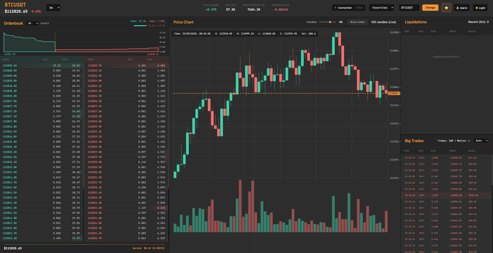

<div align="center">

# Bybit WebSocket Dashboard

### Real-time Cryptocurrency Trading Intelligence

*Professional-grade market data visualization powered by Bybit's V5 WebSocket API*

[](https://nodejs.org/)
[](https://bybit-exchange.github.io/docs/v5/ws/connect)
[](https://opensource.org/licenses/MIT)



*Live orderbook depth • Real-time candlesticks • Liquidation feeds • Professional interface*

</div>

---

## 🚀 Overview

The dashboard offers a professional-grade interface for monitoring cryptocurrency markets with real-time data streams. Built with Node.js and vanilla JavaScript, it provides a lightweight yet powerful solution for traders and developers who need instant access to market data without the complexity of trading execution.

<table>
<tr>
<td align="center">💹<br><strong>Live Market Data</strong><br>Real-time price feeds</td>
<td align="center">📈<br><strong>Interactive Charts</strong><br>Customizable timeframes</td>
<td align="center">⚡<br><strong>Low Latency</strong><br>Direct WebSocket connection</td>
<td align="center">🔄<br><strong>Auto-Reconnect</strong><br>Robust error handling</td>
</tr>
</table>

## ✨ Key Features

<details>
<summary><strong>📊 Real-time Market Data</strong></summary>

- 🔥 **Live Orderbook**: 50-level depth orderbook displaying bid and ask prices with volume information
- 📈 **Candlestick Charts**: Real-time OHLC (Open, High, Low, Close) data with customizable timeframes
- 💥 **Liquidation Feed**: Live stream of liquidation events showing position closures and market sentiment
- 📊 **Price Statistics**: Current price, 24-hour change percentage, bid-ask spread, and trading volume

</details>

<details>
<summary><strong>🎮 Interactive Controls</strong></summary>

- 🔄 **Dynamic Symbol Switching**: Change between any Bybit USDT perpetual contracts (BTCUSDT, ETHUSDT, SOLUSDT, etc.)
- ⏱️ **Timeframe Selection**: Multiple candlestick intervals from 1-minute scalping to daily analysis
- 🌐 **Environment Toggle**: Switch between live mainnet data and testnet for development/testing
- 🔁 **Auto-reconnection**: Robust WebSocket connection management with automatic retry logic

</details>

<details>
<summary><strong>⚙️ Technical Capabilities</strong></summary>

- 🔌 **WebSocket Integration**: Direct connection to Bybit V5 public API endpoints
- ⚡ **Low Latency Updates**: Optimized data processing for minimal delay
- 📱 **Responsive Design**: Adaptive interface that works on desktop and mobile devices
- 🧠 **Memory Management**: Efficient data buffering with automatic cleanup to prevent memory leaks
- 🛡️ **Error Handling**: Comprehensive error recovery and connection status monitoring

</details>

## 🚀 Quick Start

> Get up and running in under 2 minutes!

### ✅ Prerequisites
- **Node.js 16+** - [Download here](https://nodejs.org/)
- **Internet connection** - For WebSocket data streams

### 📦 Installation

<table>
<tr>
<td width="50%">

**Step 1: Clone & Navigate**
```bash
git clone <repository-url>
cd live-market-dashboard
```

**Step 2: Install Dependencies**
```bash
npm install
```

</td>
<td width="50%">

**Step 3: Launch Dashboard**
```bash
npm start
```

**Step 4: Open in Browser**
```
🌐 http://localhost:3000
```

</td>
</tr>
</table>

<div align="center">
🎉 <strong>That's it! Your dashboard is now live and streaming real-time market data.</strong>
</div>

## 🖥️ Dashboard Interface

<table>
<tr>
<td align="center" width="33%">

### 📋 Orderbook Panel
*Real-time market depth*

🔴 **Ask Orders** - Sell orders
🟢 **Bid Orders** - Buy orders
📊 **50 Levels** - Full market depth
💰 **Live Spread** - Real-time calculation

</td>
<td align="center" width="33%">

### 📈 Candlestick Chart
*Live price action*

🕯️ **OHLC Data** - Complete price info
📊 **Volume Bars** - Trading activity
⚡ **Real-time** - Live updates
🎨 **Color Coded** - Bull/bear visualization

</td>
<td align="center" width="33%">

### 💥 Liquidation Feed
*Market sentiment tracker*

⚔️ **Long/Short** - Position details
💎 **Size Categories** - Smart formatting
⏰ **Timestamps** - Event timing
🚨 **Impact Levels** - Visual indicators

</td>
</tr>
</table>

## 🪙 Supported Markets

<div align="center">

**All Bybit USDT Perpetual Contracts Supported**

</div>

| Category | Examples | Focus |
|----------|----------|-------|
| 🥇 **Major Cryptos** | BTC, ETH, SOL, ADA, DOT, AVAX, MATIC | Market leaders |
| 🔥 **DeFi Tokens** | UNI, LINK, AAVE, COMP, SUSHI, CRV | Decentralized finance |
| 🚀 **Meme Coins** | DOGE, SHIB, PEPE, FLOKI | Community driven |
| ⭐ **Emerging Assets** | Hundreds of other pairs | New opportunities |

## ⏰ Timeframe Options

<table>
<tr>
<td align="center">⚡ <strong>Scalping</strong><br>1m • 3m • 5m<br><em>High-frequency</em></td>
<td align="center">📊 <strong>Intraday</strong><br>15m • 30m<br><em>Day trading</em></td>
<td align="center">📈 <strong>Swing</strong><br>1h • 4h<br><em>Medium-term</em></td>
<td align="center">🎯 <strong>Position</strong><br>1D<br><em>Long-term trends</em></td>
</tr>
</table>

## ⚙️ Configuration

<details>
<summary><strong>🔧 Quick Configuration</strong></summary>

### Environment Variables
```bash
PORT=3000                    # Server port (default: 3000)
```

### 🎯 Default Settings
| Setting | Value | Description |
|---------|-------|-------------|
| 🎯 Initial Symbol | `BTCUSDT` | Starting trading pair |
| ⏱️ Default Timeframe | `5 minutes` | Chart interval |
| 🌐 Environment | `Mainnet` | Live data feed |
| 💥 Max Liquidations | `100 events` | Memory limit |
| 📊 Max Candles | `100 periods` | Chart history |

</details>

## 👨‍💻 Development

### 🛠️ Local Development Setup
```bash
npm install
cp config.example.json config.json  # Create your config file
npm run dev
```

### 📋 Advanced Configuration

The application uses a JSON configuration file to store user preferences and settings. When you first run the application, it will automatically create a `config.json` file from the default settings.

### Configuration File Setup
1. Copy the example configuration:
   ```bash
   cp config.example.json config.json
   ```

2. Customize your settings in `config.json`:

```json
{
  "appearance": {
    "theme": "dark"                    // UI theme: "dark" or "light"
  },
  "trading": {
    "defaultSymbol": "BTCUSDT",        // Initial trading pair to load
    "defaultInterval": "5",            // Default chart timeframe, format: 1, 3, 5, 15, 60, 240, D, W, M
    "bigTradesFilter": 50000,          // Minimum USD value for big trades alert
    "whaleThreshold": 500000,          // USD threshold for whale trade classification
    "blockTradeThreshold": 1000000,    // USD threshold for block trade classification
    "alarmEnabled": false              // Audio alert for significant events
  },
  "display": {
    "maxTradesHistory": 100            // Maximum number of trades to keep in memory
  },
  "symbols": {
    "favorites": ["BTCUSDT", "ETHUSDT"], // Quick-access favorite trading pairs
    "recent": []                        // Recently viewed symbols (auto-populated)
  },
  "network": {
    "isTestnet": false                 // Use Bybit testnet instead of mainnet
  }
}
```

### Configuration API
The application provides REST endpoints to modify configuration at runtime:

- `GET /api/config` - Get current configuration
- `PUT /api/config/:path` - Update specific setting (e.g., `/api/config/appearance.theme`)
- `POST /api/config` - Update multiple settings
- `POST /api/config/reset` - Reset to default configuration

Settings are automatically saved and persist between application restarts.

### 🗂️ Project Structure
```
📦 live-market-dashboard
├── 🖥️  server.js              # Express server with Socket.io
├── 📁 src/
│   ├── 🔌 websocket-client.js # Bybit WebSocket connection
│   ├── 📊 orderbook-manager.js # Orderbook data processing
│   ├── 📈 kline-manager.js    # Candlestick data handling
│   └── 💥 liquidation-manager.js # Liquidation processing
├── 📁 public/
│   ├── 🌐 index.html         # Frontend interface
│   ├── 🎨 style.css          # Dashboard styling
│   └── ⚡ app.js             # Client-side logic
└── 📋 package.json           # Dependencies and scripts
```

## 🔌 API Integration

<div align="center">

**Direct connection to Bybit's V5 WebSocket API**

</div>

| Environment | Endpoint | Purpose |
|-------------|----------|---------|
| 🌐 **Mainnet** | `wss://stream.bybit.com/v5/public/linear` | Live trading data |
| 🧪 **Testnet** | `wss://stream-testnet.bybit.com/v5/public/linear` | Development/testing |

### 📡 Subscribed Topics
- 📊 `orderbook.50.{SYMBOL}` - 50-level orderbook updates
- 📈 `kline.{INTERVAL}.{SYMBOL}` - Real-time candlestick data
- 💥 `allLiquidation.{SYMBOL}` - Complete liquidation events

## 🛠️ Troubleshooting

<details>
<summary><strong>⚠️ Common Issues & Solutions</strong></summary>

| Issue | Solution |
|-------|----------|
| 🔌 **Connection Problems** | Verify internet connectivity and Bybit API status |
| 🔤 **Symbol Errors** | Use correct format: `BTCUSDT` (not `BTC/USDT`) |
| 🐌 **Performance Issues** | Close unnecessary browser tabs, check system resources |
| ⏱️ **Data Delays** | Allow 30-60 seconds for initial data population |

</details>

---

<div align="center">

## 📄 License

**MIT License** - Feel free to use and modify

<br>

*Made with ❤️ for the crypto trading community*

<br>

[](https://github.com/gabrielee5/live-market-dashboard)

</div>